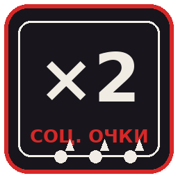

# Множитель социальных очков — мод для Reloaded-II (Persona 5 Royal)

Небольшой мод, который умножает **все получаемые очки социальных характеристик**
(Знания, Смелость, Ловкость, Доброта, Обаяние). Множитель задаётся в настройках мода, мод
можно включать и выключать в любой момент, а **файлы игры не изменяются** — мод работает
только со значениями, которые игра сама держит в памяти.

English version of this page: [README.md](README.md)



## Возможности

| | |
|---|---|
| Множитель | 1…10 — в настройках мода в лоадере или в `Config.json` (можно дробный, например 2.5) |
| Включение/выключение | переключатель в списке модов, `"Enabled": false` в настройках или кнопки Suspend/Resume |
| Применяется на ходу | настройки подхватываются во время игры, перезапуск не нужен |
| Что покрыто | все источники очков: ответы в классе, книги, подработки, спортзал, готовка, встречи и ранги конфидантов, сюжетные бонусы |
| Безопасность | мод не спорит с игрой: скачок больше 100 очков (загрузка сейва) не умножается; 16-битный счётчик не переполняется (32767) |
| Файлы игры | ничего не пишется в папку игры, в CPK-архивы и в сохранения |
| Обновления | лоадер сам предлагает новые версии (см. ниже) |

## Какую версию ставить

В релизе две сборки, внутри они одинаковые — отличаются только языком надписей (название
мода в лоадере, подписи настроек, сообщения в логе):

| Архив | Название в лоадере | Для кого |
|---|---|---|
| `P5R.SocialStatMultiplier_RU.zip` | Множитель социальных очков | русская версия |
| `P5R.SocialStatMultiplier_EN.zip` | Social Stat Multiplier | английская версия |
| `P5R.SocialStatMultiplier_RU_EN.zip` | обе версии в одном архиве | если хочется почитать оба README или собрать из исходников |

Ставить нужно **одну** версию: у них одинаковый `ModId`, поэтому одновременно в папке `Mods`
может лежать только одна.

## Установка

1. Скачать архив для своего языка со страницы [Releases](../../releases).
2. Скопировать папку `P5R.SocialStatMultiplier` (из папки `Mods` внутри архива) в
   `<папка Reloaded-II>\Mods\`.
3. Запустить Reloaded-II, найти мод и убедиться, что его переключатель включён.
4. Убедиться, что установлен и включён мод-библиотека **Reloaded.Memory.SigScan.ReloadedII**
   (идёт в комплекте с Reloaded-II).
5. Запустить игру через Reloaded-II.

Если страница мода на [GameBanana](https://gamebanana.com/) открыта во встроенном браузере
модов, архив поставится сам: внутри лежит маркер `RELOADED` для 1-click установки.

## Как менять множитель

* Лоадер → кнопка с шестерёнкой (**Configure**) рядом с модом → **Множитель**: любое значение
  от 1 до 10 (`2` — удваивает каждое начисление, `3` — утраивает, `1` — обычное поведение игры).
* Либо файл `<папка Reloaded-II>\User\ModConfigs\P5R.SocialStatMultiplier\Config.json`:

  ```json
  {
    "Enabled": true,
    "Multiplier": 2,
    "VerboseLog": false
  }
  ```

  `VerboseLog: true` пишет каждое начисление в лог лоадера — удобно проверить, что мод
  работает (например, `Обаяние: +2 → +4 (всего 46)`).

Значения применяются на ходу, перезапускать игру не нужно. Кнопки **Suspend**/**Resume**
в лоадере выключают и включают мод прямо во время игры.

## Автообновление

Мод привязан к релизам этого репозитория: лоадер спрашивает последний тег и предлагает
обновление, когда оно появилось, — скачивая файл, имя которого прописано в `ModConfig.json`
(`P5R.SocialStatMultiplier_RU.zip` / `P5R.SocialStatMultiplier_EN.zip`). Настройки из
`Config.json` при обновлении сохраняются. Вручную: скачать свежий архив и заменить папку мода.

## Скриншоты


<!-- Раздел ниже показывается только когда в docs/img/ появятся картинки.
     Как снять — см. docs/img/README.md, потом убери эти комментарии.


-->

## Как это работает

Игра хранит пять социальных характеристик как пять 16-битных значений подряд в памяти. Мод
находит этот массив по сигнатуре байтов, запоминает текущее значение каждой характеристики и
раз в 20 мс проверяет его. Если значение выросло — прирост умножается и записывается обратно,
а новое значение становится базой для следующей проверки, поэтому одно начисление никогда не
умножается дважды. Скачок больше 100 очков считается загрузкой сейва или сбросом и не
трогается, а результат ограничивается значением 32767 — игра хранит эти характеристики как
16-битные знаковые числа.

Сама сигнатура взята из открытого мода [p5rpc.SocialStatTracker](https://github.com/AnimatedSwine37/p5rpc.SocialStatTracker)
автора **AnimatedSwine37** — см. «Благодарности».

## Если что-то не работает

| Симптом | Что делать |
|---|---|
| В лоадере «Несовместим с приложением» | Ваш `p5r.exe` не тот, под который собран мод, — напишите в issue версию игры. |
| В логе «сигнатура не найдена» | Сборка `p5r.exe` отличается; в этом случае мод вообще ничего не меняет. Напишите версию игры (репак / Steam / Microsoft Store). |
| Очки не умножаются | Проверьте, что `Multiplier` больше 1 и `Enabled` = `true`; включите `VerboseLog` и посмотрите лог лоадера в момент начисления очков. |
| Лоадер не может загрузить мод | Проверьте, что установлен и включён `Reloaded.Memory.SigScan.ReloadedII`, а среда .NET 7, установленная вместе с Reloaded-II, обновлена. |

## Сборка из исходников

Нужен .NET SDK 8 (или новее) и python3:

```bash
bash build.sh              # собирает обе версии, прогоняет тесты, пакует dist/*.zip
DOTNET=/путь/к/dotnet bash build.sh    # если dotnet не в PATH
```

`build.sh` собирает русскую и английскую версии из одного кода (`-p:ModLang=EN` переключает
тексты), прогоняет тестовый проект против обеих DLL и пакует три релизных архива в `dist/`.
Тот же скрипт запускается в GitHub Actions
([.github/workflows/build.yml](.github/workflows/build.yml)): каждый push собирается и
тестируется, а тег вида `v1.1.1` публикует релиз с приложенными архивами.

## Тесты

Тестовый проект (`P5R.SocialStatMultiplier.Tests`) создаёт настоящий объект мода, подсовывает
ему подставной массив очков и играет роль игры: **19 из 19 сценариев проходят** — удвоение и
утроение прироста, повторные начисления, отсутствие саморазгона, загрузка сейва, сброс
значений, смена множителя на ходу, `Enabled = false`, Suspend/Resume, последовательность
вызовов лоадера до старта мода, защита от переполнения 32767, множитель ×1 и корректное
завершение.

Единственное, что нельзя проверить вне настоящей игры, — совпадение сигнатуры памяти в
конкретной сборке `p5r.exe`. Если она не совпадёт, мод напишет в лог
`Сигнатура очков социальных характеристик не найдена` и не изменит ничего вообще.

## Благодарности

* [Reloaded-II](https://github.com/Reloaded-Project/Reloaded-II) — лоадер и шаблон мода, на
  котором основан проект.
* [Reloaded.Memory.SigScan](https://github.com/Reloaded-Project/Reloaded.Memory) — поиск
  сигнатур в памяти.
* Сигнатура массива социальных очков взята из открытого мода
  [p5rpc.SocialStatTracker](https://github.com/AnimatedSwine37/p5rpc.SocialStatTracker) автора
  **AnimatedSwine37** — спасибо, что выложил её.

## Дисклеймер

Неофициальный мод, сделанный фанатами. Не связан с Atlus и Sega и не одобрен ими. Никакие
ресурсы игры, исполняемые файлы или извлечённые данные не входят ни в этот репозиторий, ни в
релизные архивы — только собственный код. *Persona 5 Royal* и связанные с ней названия
принадлежат их правообладателям.

## Лицензия

[MIT](LICENSE)
